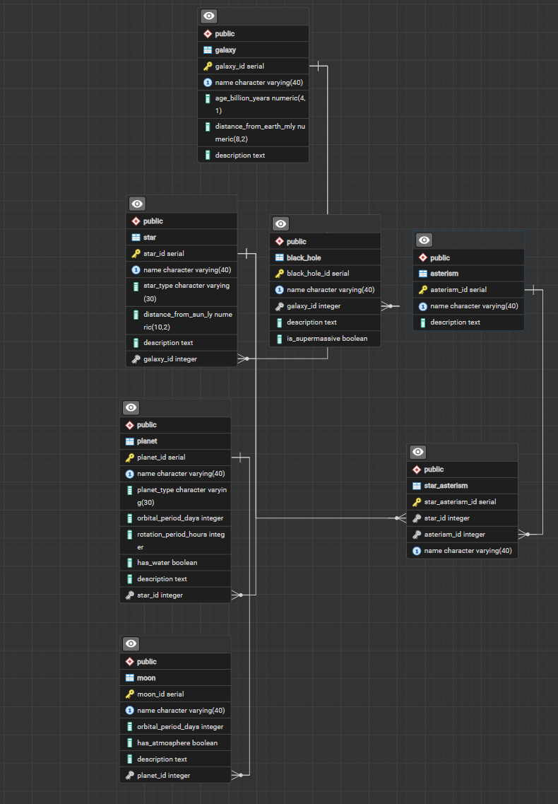

<div align="center">

# 🌌 Celestial Bodies Database

### FreeCodeCamp Relational Database Certification Project


</div>

---

## 🚀 About the Project

A relational **PostgreSQL database** created as part of the
**FreeCodeCamp Relational Database Certification**.

The project models celestial bodies and their relationships using
SQL, primary keys, foreign keys, constraints, different data types,
and relational database design principles.

The database was developed using **PostgreSQL and psql** in
**GitHub Codespaces**.

---

## 🪐 Database Structure

The database contains **7 related tables**:

| Table | Purpose |
|---|---|
| `galaxy` | Stores information about galaxies |
| `star` | Stores stars and their parent galaxies |
| `planet` | Stores planets and their parent stars |
| `moon` | Stores moons and their parent planets |
| `black_hole` | Stores black holes and their galaxy relationships |
| `asterism` | Stores named asterisms |
| `star_asterism` | Junction table connecting stars and asterisms |

### 🔗 Relationships

```text
Galaxy
 ├── Star
 │    └── Planet
 │         └── Moon
 │
 └── Black Hole

Star
 └── Star_Asterism
       └── Asterism
```

The `star_asterism` table demonstrates a **many-to-many (M:N)
relationship** between stars and asterisms by using a junction table.
The junction table converts the M:N relationship into two one-to-many
relationships.

---

## 🧠 Design Decisions

### 🕳️ Nullable `black_hole.galaxy_id`

The `black_hole.galaxy_id` foreign key was intentionally left nullable
to **showcase** that a black hole can be associated with a galaxy, but
can also exist in the database without a galaxy assigned.

Therefore, `NULL` values are intentionally accepted in this field.

This demonstrates how a nullable foreign key can represent an optional
relationship in a relational database.

### 📐 Integer-Based Astronomical Values

The project required integer fields for astronomical measurements, so
the following columns use `INT`:

- `planet.orbital_period_days`
- `planet.rotation_period_hours`
- `moon.orbital_period_days`

In reality, these astronomical measurements are not always whole
numbers. Therefore, the values stored in this project are **simplified
and approximate** to satisfy the project's integer requirement.

---

## 🧩 Concepts Demonstrated

- Primary keys
- Foreign keys
- Auto-incrementing `SERIAL` identifiers
- One-to-many relationships
- Many-to-many relationships
- Junction tables
- Optional relationships using nullable foreign keys
- `NOT NULL` constraints
- `UNIQUE` constraints
- `INTEGER` data types
- `NUMERIC` data types
- `BOOLEAN` data types
- `TEXT` data
- SQL joins
- Database queries using `psql`
- PostgreSQL database dumps and restoration

---

## 🛠️ Technologies

- 🐘 **PostgreSQL**
- 💻 **SQL**
- ⌨️ **psql**
- ☁️ **GitHub Codespaces**
- 🎓 **FreeCodeCamp Relational Database Certification**

---

## 📦 Repository Contents

- `universe.sql` — PostgreSQL database dump
- `universe_db_ERD.png` — Entity Relationship Diagram

The SQL dump provides a portable snapshot of the completed database
that can be restored in a PostgreSQL environment.

---

## 📊 Entity Relationship Diagram



---

## 🎓 Certification

This project was completed as part of the:

**FreeCodeCamp Relational Database Certification**

The project demonstrates practical work with PostgreSQL, SQL queries,
relational database design, constraints, relationships, database
dumps and restoration, and the `psql` command-line interface.

---

<div align="center">

⭐ **SQL • PostgreSQL • Relational Database Design**

</div>
